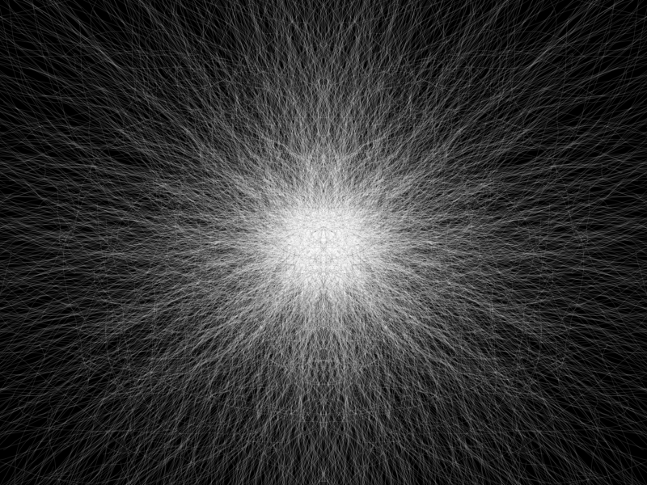
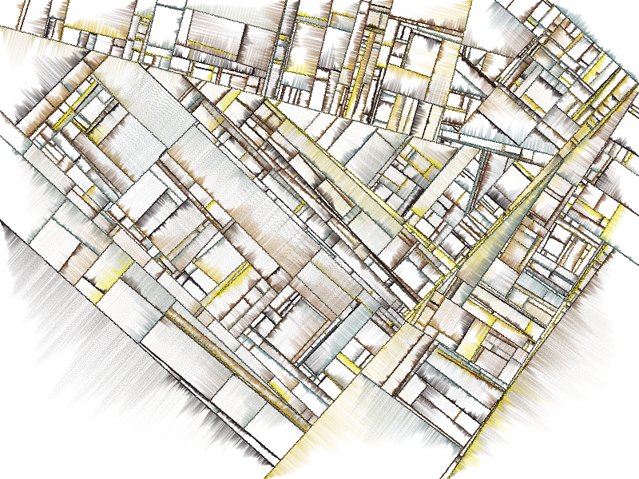
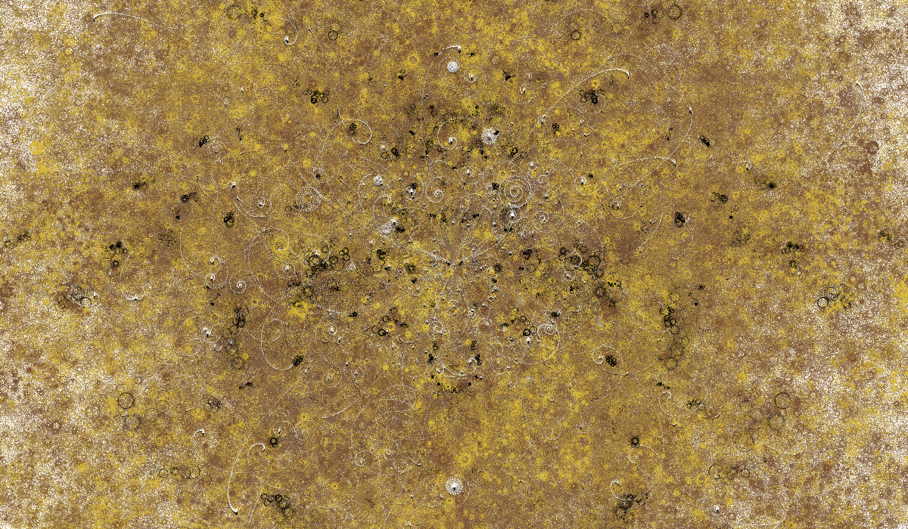

# Amazing Tarbell

With this project I plan to "translate" Jared S Tarbell algorithms available on [complexification.net](http://www.complexification.net/gallery/) to Haskell.

I wrote [a blog post](http://www.cirstei.ro/generative-art-in-haskell/) about the process and decisions I made.

## Some images I produced with these algorithms

Binary Ring

Substrate

Bubble Chamber

